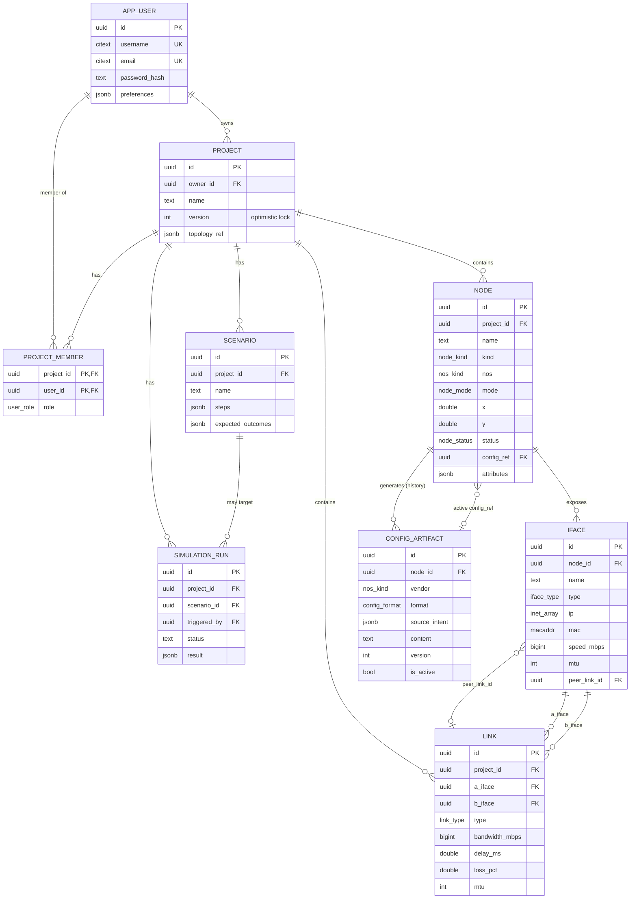

# NetForge — Entity-Relationship Diagram

Diagram relasi entitas lapisan data NetForge, mengacu pada `schema.sql` dan
MASTER_SPEC §4. Notasi Mermaid (`erDiagram`) + ringkasan kardinalitas as-text.

## Diagram (Mermaid)

## Kardinalitas (as-text)

- **APP_USER 1 — N PROJECT** — satu user memiliki banyak project (`project.owner_id`).
  `ON DELETE RESTRICT`: user tak bisa dihapus jika masih punya project.
- **PROJECT N — M APP_USER** via **PROJECT_MEMBER** — kolaborasi multi-user
  dengan RBAC per-project (`role`).
- **PROJECT 1 — N NODE / LINK / SCENARIO / SIMULATION_RUN** — semuanya cascade
  saat project dihapus.
- **NODE 1 — N IFACE** — node mengekspos banyak interface (`§4 interfaces[]`).
- **IFACE 2 — 1 LINK** — sebuah link point-to-point menghubungkan tepat dua
  interface (`a_iface`, `b_iface`), constraint `a_iface <> b_iface` + UNIQUE pair.
- **IFACE 1 — 0..1 LINK** (`peer_link_id`) — pointer balik dari interface ke
  link yang terpasang; `ON DELETE SET NULL` saat link dihapus (jadi unwired).
- **NODE 1 — N CONFIG_ARTIFACT** — riwayat append-only config. Tepat satu yang
  `is_active` (partial unique index) dan dirujuk `node.config_ref` (0..1).
- **SCENARIO 1 — N SIMULATION_RUN** — satu skenario bisa dieksekusi berkali-kali.

## Catatan integritas penting

1. **Dua FK siklik** sengaja dibuat dan ditutup setelah kedua tabel ada:
   - `iface.peer_link_id → link.id` (SET NULL)
   - `node.config_ref → config_artifact.id` (SET NULL)
   Backend harus membuat baris induk dulu, lalu meng-`UPDATE` pointer.
2. **Versioning**: `project.version` adalah optimistic-lock counter (naik tiap
   mutasi topologi). `config_artifact` versioning lewat `version` + append-only.
3. **JSONB** dipakai untuk data yang berevolusi: `topology_ref`, `attributes`,
   `steps`, `expected_outcomes`, `source_intent`, `result`. Di-index GIN bila
   sering dikueri.
